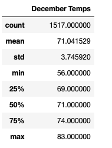
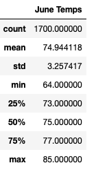

# Surfs_Up

## Overview:
There are many factors that goes into opening a successful business. An ice cream and surf shop has multiple factors outside of the owners control that majorly inpacts success, one of those factors-- the weather. This analysis looks at weather data on the island of Oahu. We look at temprature trends in June and December to see if it is possible to have a successful shop that sells surf equipment and serves ice cream. 

## Results:

1. The avereage temperature in June (74.9 degrees) is slightly higher than the average temperature in December (71 degrees).
2. The minimum temerature in June is 64 degrees while the minimum temperature in December is 56 desgrees. 
3. Decembers max temperature is slightly higer (83 degrees) than Junes (85 degrees)

## Summary: 
Based on temperature, there does not seem to be any major differences in the weather, except the minumum temperature. Ther average temperature is in the 70's for both months. Addidtions queiries that would be benefitial to look at the summary statistics on percepitation for both months. If possible, it may be helpful to look at wind direction and speed as it can dictates ideal surfng conditions. 

